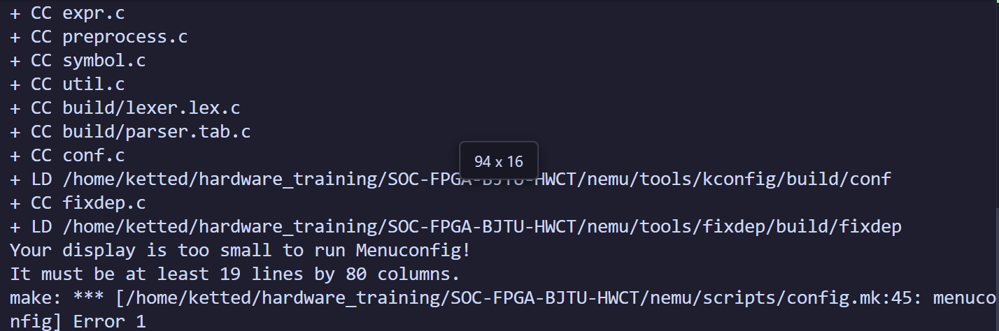
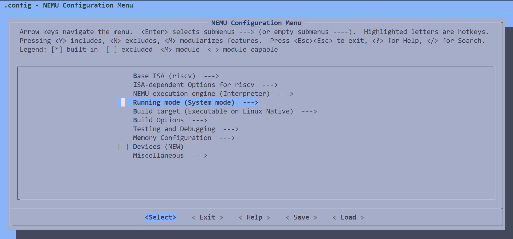

# SOC-FPGA RISC-V 处理器项目

一个完整的 RISC-V 片上系统（SoC）项目，支持：

- 使用 NEMU 做功能级软件调试
- 使用 Verilator 做 RTL 仿真和波形调试
- 使用 Vivado 综合、实现并烧录到 Xilinx FPGA

本项目的推荐上手顺序是：先配置 Linux/WSL 环境和 RISC-V 工具链，再配置仓库自带的 NEMU，然后从 `sim/simple` 跑通 `make build`、`make run`、`make rtl_run` 和 `make trace_run`。

> [!NOTE]
> 本项目的 CPU 及核心架构基于并衍生自 [yuheng-riscv-soc](https://gitee.com/dengchow/yuheng-riscv-soc)，部分处理器框架也使用了该开源项目的设计与代码。上游项目采用 Apache License 2.0。本项目依照该许可证使用、修改和分发相关衍生内容，并保留相应的版权、许可证和归属声明。本仓库包含对上游内容的修改；具体许可条件请参阅本仓库的 [LICENSE](./LICENSE) 文件。上述说明不表示上游作者对本项目提供认可或背书。

---

## 项目结构

```text
soc-fpga/
├── rtl/                    # 主 RTL 源码，用于综合和上板
│   ├── core/               # RISC-V 处理器核心
│   ├── perips/             # TCM、Timer、UART 等外设
│   ├── soc/                # SoC 总线互联
│   ├── utils/              # 公共模块
│   ├── pa_chip_param.v     # 芯片参数定义
│   └── pa_chip_top.v       # FPGA 顶层
├── diff-tools/
│   ├── rtl/                # Verilator 仿真使用的 RTL 副本
│   ├── sim_tools_simple/   # Verilator 仿真环境
│   └── Makefile            # RTL 同步维护入口
├── sim/                    # 示例程序和通用构建规则
│   ├── build.mk
│   ├── config.mk
│   ├── simple/
│   ├── timer/
│   ├── systick/
│   ├── xprintf/
│   ├── ecall/
│   ├── coremark/
│   ├── rtthread-nano/
│   ├── uart_recv/
│   ├── uart_recv_dbg/
│   ├── iap_app/
│   ├── iap_app-test/
│   └── bin-creater/
├── nemu/                   # 仓库自带的 NEMU，不需要额外下载
├── libs/                   # 启动代码、SDK、ABI、工具函数
├── scripts/                # 辅助脚本
├── project/                # Vivado 工程
├── ipdefs/                 # Xilinx IP 定义
├── tb/                     # Testbench
└── bit/                    # 已生成的 bitstream
```

---

## 1. 准备环境

### 1.1 操作系统

除 Vivado 生成 bitstream 和烧录 FPGA 外，推荐在 Ubuntu 22.04 环境中完成编译、NEMU 调试和 Verilator 仿真。可以选择：

1. WSL2
2. VMware/VirtualBox 虚拟机
3. 移动硬盘安装的 Linux 系统

这里推荐使用 WSL 安装 Ubuntu，并提供实践教程：[WSL 安装 Ubuntu 22.04](./configuration.md)。

对于需要上 FPGA 开发板测试的同学，需要下载 Vivado 2023.2。下载方式请参考：[Vivado 下载文档](https://my.feishu.cn/docx/W1h7dwGknooheIxk7mwcp0Dtnme)。（2026 年 BJTU 暑期实训的同学不需要下载。）

### 1.2 推荐编辑器

强烈建议大家使用 VS Code 或 Cursor 进行代码编写、阅读和调试。这个项目同时包含 C、Makefile、Verilog/SystemVerilog、Markdown 文档和仿真波形相关文件，使用 VS Code/Cursor 可以更方便地做全局搜索、跳转定义、查看 Git 修改、预览 Markdown，并配合 AI 工具理解代码。

推荐安装以下插件：

| 插件 | 发布者 | 推荐用途 |
|------|--------|----------|
| Codex - OpenAI's coding agent | OpenAI | 辅助阅读代码、解释报错、生成修改建议；适合在不熟悉代码结构时快速定位问题 |
| Markdown All in One | Yu Zhang | 编写 README 和实验报告，支持 Markdown 快捷键、目录、列表和格式化 |
| Markdown Preview Enhanced | Yiyi Wang | 预览复杂 Markdown 文档，查看表格、代码块和排版效果 |
| Verilog-HDL/SystemVerilog/Bluespec SystemVerilog | Masahiro Hiramori | 提供 Verilog/SystemVerilog 语法高亮、代码跳转、格式辅助和基础检查 |

### 1.3 安装基础工具

建议先换国内 apt 源：[清华大学 Ubuntu 镜像使用帮助](https://mirrors.tuna.tsinghua.edu.cn/help/ubuntu/)，然后安装基础工具：

```bash
sudo apt update
sudo apt install -y make build-essential git vim nano python3 python3-pip
sudo apt install -y iverilog verilator gtkwave
```

GTKWave 用于查看 `make trace_run` 生成的 VCD 波形。

### 1.4 安装 RISC-V 交叉编译工具链

安装工具链构建依赖：

```bash
sudo apt install -y autoconf automake autotools-dev curl
sudo apt install -y libmpc-dev libmpfr-dev libgmp-dev gawk
sudo apt install -y bison flex texinfo gperf libtool patchutils
sudo apt install -y bc zlib1g-dev libexpat-dev ninja-build cmake libglib2.0-dev
sudo apt install -y build-essential libncurses-dev bison flex
```

下载并编译 `riscv-gnu-toolchain`（通常这个步骤耗时较久，可能需要 3-4 小时）：

```bash
git clone --recursive https://github.com/riscv/riscv-gnu-toolchain
cd riscv-gnu-toolchain
mkdir build
cd build

../configure \
  --prefix=/opt/riscv32im_zicsr \
  --target=riscv32-unknown-elf \
  --enable-multilib \
  --with-multilib-generator="rv32im_zicsr-ilp32--;" \
  --with-arch=rv32im_zicsr \
  --with-abi=ilp32

sudo make -j $(nproc)
```

如果你没有办法科学上网，下载`git clone --recursive https://github.com/riscv/riscv-gnu-toolchain`会非常慢，甚至失败。我们推荐你使用镜像站下载
`git clone --recursive https://githubfast.com/riscv/riscv-gnu-toolchain`
如果这个方法也不行，你可以向老师要一份已经下好的riscv-gnu-toolchain。

配置环境变量：

```bash
echo 'export PATH=/opt/riscv32im_zicsr/bin:$PATH' >> ~/.bashrc
source ~/.bashrc
```

验证工具链：

```bash
riscv32-unknown-elf-gcc --version
```

如果成功会输出：

```bash
riscv32-unknown-elf-gcc (g5115c7e44) 15.2.0
Copyright (C) 2025 Free Software Foundation, Inc.
This is free software; see the source for copying conditions.  There is NO
warranty; not even for MERCHANTABILITY or FITNESS FOR A PARTICULAR PURPOSE.
```
### 1.5 检查 `sim/config.mk`

Linux 下默认使用：

```makefile
EMBTOOLPREFIX = riscv32-unknown-elf
CC            = ${EMBTOOLPREFIX}-gcc
PYTHON        = python3
```

如果你的工具链安装路径不同，请修改 [sim/config.mk](sim/config.mk)。

---

## 2. 初始化 NEMU

本仓库已经自带 `nemu/` 目录，首次使用 NEMU 前，请先完成配置：

```bash
cd nemu
export NEMU_HOME=$(pwd)
make menuconfig
```

**注意：执行`make menuconfig`的时候如果报错，可能是有某一些包没有被补充，你需要自己网络搜索，或者使用ai，对一些可能缺失的库进行补充**



`make menuconfig` 会打开终端图形配置界面。假如报错如上图所示，说明你的终端窗口的长和宽不够，建议先把终端放大后再运行。

### 2.1 Build Options（构建选项）



在上述界面中选择 Build Options，然后按 Enter 确认，即可看到一些调试选项。

- 监视点功能：是否开启 watchpoint，默认关闭。
- 并行监视点：不建议开启，会严重影响模拟性能。

### 2.2 Testing and Debugging（测试和调试）

在上述界面中选择 Testing and Debugging，然后按 Enter 确认，即可看到一些调试选项。

- Instruction Tracer：显示执行的每条指令，默认关闭。
- Memory Tracer：追踪显示每次 load/store 指令，默认关闭。
- Function Tracer：显示程序的每次函数调用，默认关闭。
- Device Tracer：显示每次对外设的访问，默认关闭。
- Exception Tracer：显示每次 ecall 指令触发和上下文切换时的 CSR 寄存器，默认关闭。
- Diff Test：用于编写模拟器时验证正确性，目前尚未完全实现，请保持关闭，默认关闭。

### 2.3 Device（设备选项）

在上述界面中选择 Device，然后按 Enter 确认，即可看到一些调试选项。

Device 默认全部关闭。如果要运行 RT-Thread Nano，必须开启两个 hardware device：

- Timer（定时器）
- UART（串口）

新手推荐配置：

- Build Options：保持默认选项
- Testing and Debugging：保持默认选项
- Device：开启 Timer 和 UART

### 2.4 保存配置

点击 Save 按钮保存配置。保存配置后，编译 NEMU：

```bash
make clean && make
```

如果直接执行 `make` 后看到：

```text
.config does not exist
```

说明 NEMU 还没有保存配置，请回到 `nemu/` 目录重新执行 `make menuconfig` 并保存。

---

## 3. 跑通第一个程序

如果刚完成上一节的 NEMU 配置，此时通常位于 `nemu/` 目录。先回到示例目录：

```bash
cd ../sim/simple
```

### 3.1 编译程序

```bash
make build
```

生成文件：

| 文件 | 说明 |
|------|------|
| `riscv.elf` | ELF 可执行文件，包含符号信息 |
| `riscv.dump` | 反汇编文件 |
| `riscv.bin` | NEMU 和 RTL 仿真加载的二进制文件 |
| `riscv.map` | 链接报告 |
| `rom.coe` | Vivado 存储器初始化文件 |

### 3.2 使用 NEMU 运行

在 `simple` 目录下执行：

```bash
make run
```

`make run` 会：

1. 自动编译当前示例程序
2. 启动 NEMU
3. 加载 `riscv.elf` 和 `riscv.bin`
4. 进入 NEMU 交互调试界面

需要注意的是，由于 `simple` 的 `main` 函数调用了 `xprintf` 函数，而该函数当前还没有实现，因此程序执行结束时虽然会显示 `HIT GOOD TRAP at pc = 0x8000008c`，但不会产生任何输出。

看到 `HIT GOOD TRAP at pc = 0x8000008c`，说明 NEMU 可以正常工作。

**到此为止，环境配置完成。**

如果想使用 NEMU 调试 `simple` 程序，可以参考“2. 初始化 NEMU”中的说明，打开 watchpoint 和 instruction trace，然后按照下面的内容进行调试。

常用 NEMU 命令：

| 命令 | 说明 |
|------|------|
| `help` | 显示帮助 |
| `c` | 继续运行 |
| `q` | 退出 NEMU |
| `si` | 单步执行一条指令 |
| `info r` | 查看寄存器 |
| `info w` | 查看监视点 |
| `x n address` | 查看内存，例如 `x 10 0x80000000` |
| `p expr` | 计算表达式（必须开启 watchpoint），例如 `p $x1 + $x2` |
| `w expr` | 设置监视点（必须开启 watchpoint），例如 `w pc==0x800000F4` |
| `d n` | 删除第 n 个监视点 |

请找到同目录下的 `riscv.dump` 文件。当你在 NEMU 中输入 `si` 单步执行指令时，会发现当前执行的指令就是 `riscv.dump` 的第一条指令。

同样，你可以先输入 `w pc==0x8000028` 设置断点，再输入 `c` 让 PC 运行到指定指令处，然后通过 `info r` 查看寄存器是否符合预期。具体操作可以参考：[实验五：启动操作系统](https://my.feishu.cn/docx/AzRUdyQ8DoXEdvxAVaJcozXAnhh)。

你可能会看到一个黑色窗口弹出，这是 NEMU 的 VGA 窗口。虽然当前 CPU 暂不支持 VGA，但 NEMU 作为模拟器支持 VGA 显示；相关驱动代码暂时还没有提供。

如果要关闭 NEMU，只需要在命令行界面输入 `q`。

如果希望不进入交互界面，只想要直接执行程序看结果，直接批处理运行：

```bash
make run MODE=b
```

如果开启了各种 Tracer，终端中会显示指令执行的中间过程。你也可以修改框架代码，将输出重定向到文件中，这部分留给你探索。

### 3.3 使用 RTL 仿真运行

在 `simple` 目录下执行：

```bash
make rtl_run
```

`make rtl_run` 会：

1. 自动编译当前示例程序
2. 调用 Verilator 编译 `diff-tools/rtl`
3. 启动交互式 RTL 仿真器

RTL 仿真器常用命令：

| 命令 | 作用 |
|------|------|
| `s` 或回车 | 单步执行一个周期 |
| `c` | 连续运行直到结束或遇到断点 |
| `c 100` | 连续运行 100 个周期 |
| `w pc==0x80000000` | 设置 PC 断点 |
| `info r` | 查看寄存器 |
| `trace on` | 从当前周期开始记录波形 |
| `trace off` | 停止记录波形 |
| `h` | 查看帮助 |
| `q` | 退出仿真 |

`make rtl_run` 适合快速验证 RTL 能否运行程序。

需要注意的是，NEMU 只是一个 CPU 模拟器；执行 `make rtl_run` 时，会调用 Verilator 工具，将你用 Verilog 代码实现的 CPU 编译成 Linux 上的可执行文件，并加载 `simple` 程序生成的 `bin` 文件。这模拟的是实际硬件的启动方式。

换而言之，如果 `rtl` 目录下的代码不正确，执行 `make rtl_run` 时大概率会跑飞。只有当 `make run` 和 `make rtl_run` 的执行结果相同，才能说明你实现的 CPU 在功能上正常。

### 3.4 生成波形并调试

在 `simple` 目录下执行：

```bash
make trace_run
```

`make trace_run` 会在启动 RTL 仿真时自动开启 VCD 波形记录。默认波形文件为：

```text
diff-tools/sim_tools_simple/obj_dir/sim.vcd
```

> 注意：VCD 波形文件会非常大，长时间开启 `trace_run` 会快速占满磁盘空间。如果不限制记录窗口，运行约 1 分钟就可能生成十几 GB 的 `sim.vcd`。调试时建议使用短程序，或通过 `--trace-start`、`--trace-cycles` 只截取关键周期。

打开波形：

```bash
make wave
```

也可以使用：

```bash
make gtkwave
```

这两个命令会打开 `diff-tools/sim_tools_simple/obj_dir/sim.vcd`，并自动加载 `diff-tools/sim_tools_simple/debug1.gtkw` 中预设的波形显示布局。如果还没有生成波形文件，请先执行 `make trace_run`。

如果只想记录某一段周期，可以直接调用仿真工具：

```bash
cd ../../diff-tools/sim_tools_simple
make tracerun \
  BIN_PATH=../../sim/simple/riscv.bin \
  SIM_ARGS="--trace-start 100 --trace-cycles 200 --trace-file simple.vcd"
```

常用 trace 参数：

| 参数 | 作用 |
|------|------|
| `--trace` | 开启波形记录 |
| `--trace-start N` | 从第 N 个周期开始记录 |
| `--trace-cycles N` | 记录 N 个周期后停止 |
| `--trace-file FILE` | 指定输出 VCD 文件名 |

GTKWave 调试建议：

1. 先用 `make rtl_run` 交互运行，判断程序大概在哪个阶段异常。
2. 用 `w pc==0x80000000` 设置断点，或用 `c N` 跑到接近异常的周期。
3. 用 `make trace_run` 或 `SIM_ARGS="--trace-start ... --trace-cycles ..."` 截取关键窗口。
4. 在 GTKWave 中重点看 PC、指令、寄存器写回、访存接口和外设访问，向前追溯第一个异常周期。

外部资料：

| 资料 | 说明 |
|------|------|
| [GTKWave 官方文档](https://gtkwave.github.io/gtkwave/) | GTKWave 支持的波形格式和功能说明 |
| [GTKWave 快速启动](https://gtkwave.github.io/gtkwave/quickstart/launching.html) | 如何启动 GTKWave 并加载 VCD |
| [GTKWave 菜单说明](https://gtkwave.github.io/gtkwave/ui/menu.html) | Reload、保存视图、导出截图等功能 |

### 3.5 清理生成文件

```bash
make clean
```

在 `sim/*` 示例目录中执行 `make clean` 时，会同时调用 NEMU 的 `clean-all` 清理规则。NEMU 部分辅助工具依赖外部内容，例如 `capstone`、`spike-diff` 的 `repo` 目录，相关 Makefile 可能会在需要时自动下载这些内容，请确保网络环境可用。

---

## 4. 示例程序说明

| 示例目录 | 功能描述 | 适用场景 |
|---------|---------|---------|
| `simple/` | 最简单的流水线测试程序 | 入门学习 |
| `timer/` | 定时器中断示例 | 外设驱动学习 |
| `systick/` | 系统滴答定时器 | 操作系统基础 |
| `xprintf/` | 打印功能测试 | 调试输出 |
| `ecall/` | 系统调用示例 | 了解 ABI 接口 |
| `coremark/` | CoreMark 性能测试 | 性能评估 |
| `rtthread-nano/` | RT-Thread Nano 实时系统 | 学习 RTOS |
| `uart_recv/` | UART 接收与发送 | 特殊上板测试 |
| `uart_recv_dbg/` | UART 接收调试 | 特殊上板测试 |
| `iap_app/` | 原地升级应用 | OTA/上板测试 |
| `iap_app-test/` | IAP 测试程序 | OTA/上板测试 |
| `bin-creater/` | 固件镜像生成工具 | 上板测试准备 |

`bin-creater/`、`iap_app/`、`iap_app-test/`、`uart_recv/`、`uart_recv_dbg/` 等程序主要用于特殊上板测试或固件生成流程。由于这些程序的 `link.lds` 地址布局与当前 NEMU 地址空间配置不完全一致，通常不能直接通过 `make run` 在 NEMU 中运行。

---

## 5. RTL 结构

### 5.1 处理器流水线

```text
PC Gen → IDU → EXU → MAU → WB
         ↓
        CSR/RegFile
         ↓
        CLINT
```

| 模块 | 说明 |
|------|------|
| PCGen | 程序计数器生成 |
| IDU | 指令译码 |
| EXU | 算术逻辑、乘除法、CSR 操作 |
| MAU | 内存访问 |
| RTU | 寄存器读写和回写 |
| CLINT | 中断和异常控制 |

### 5.2 存储映射

| 地址范围 | 外设 |
|---------|------|
| `0x8000_0000 ~ 0x8000_7FFF` | TCM 代码和数据 |
| `0x8000_8000 ~ 0x8000_FFFF` | 保留 |
| `0x8001_0000 ~ 0x8001_FFFF` | Timer0 |
| `0x8002_0000 ~ 0x8002_FFFF` | UART0 |
| `0x8003_0000 ~ 0x8003_FFFF` | UART1 |
| `0x8004_0000 ~ 0x8004_FFFF` | UART2 |

---

## 6. RTL 同步维护

本仓库只把外层 `rtl/` 作为主 RTL 源码：

- `rtl/`：综合和上板使用的主 RTL 源码
- `diff-tools/rtl/`：Verilator 仿真使用的 RTL 入口，其中大部分通用文件是指向外层 `rtl/` 的软链接

`diff-tools/rtl/` 只保留少量仿真专用实体文件，例如 DPI-C 调试接口、`riscv.bin` 加载、UART 标准输出、仿真参数等。其余通用 RTL 文件通过软链接复用外层 `rtl/`，避免维护两份几乎相同的代码。

软链接已经在仓库中生成，平时不需要手动维护。如果软链接被破坏，或新增了需要复用的通用 RTL 文件，可以在任意 `sim/*` 示例目录中运行：

```bash
cd sim/simple
make rtl-sync
```

这个命令会创建或修复 `diff-tools/rtl` 中指向外层 `rtl/` 的软链接。也可以在 `diff-tools/` 目录中运行同名命令：

```bash
cd diff-tools
make rtl-sync
```

目前保留为实体文件、不会被软链接替换的仿真特化文件包括：

```text
diff-tools/rtl/pa_chip_param.v
diff-tools/rtl/pa_chip_top_sim.v
diff-tools/rtl/core/pa_core_rtu.v
diff-tools/rtl/core/pa_core_top.v
diff-tools/rtl/core/pa_core_xreg.v
diff-tools/rtl/perips/pa_perips_tcm.v
diff-tools/rtl/perips/pa_perips_uart.v
```

---

## 7. FPGA 与 Vivado

### 7.1 Windows 环境

Windows 下主要用于 Vivado 工程、综合、实现和烧录。

需要：

- Vivado 2023.2
- Python 3.x
- RISC-V GCC 工具链
- GnuWin32 Make 或其他可用的 GNU Make

如果命令行提示 `make` 不是内部或外部命令，请安装 GnuWin32 Make，并把下面目录加入系统 `Path`：

我们也提供了 Windows 下的 GnuWin32 和 RISC-V 编译工具，下载地址见：[ToolsV1.0](https://github.com/ccnuktd/SOC-FPGA-BJTU-HWCT/releases/tag/ToolsV1.0)。

```text
C:\Program Files (x86)\GnuWin32\bin
```

修改环境变量后需要重新打开命令行窗口。

### 7.2 创建 Vivado 工程

修改 `auto.bat` 中的 Vivado 路径：

```batch
set VIVADO_PATH=C:\Xilinx\Vivado\2023.2\bin\vivado.bat
```

运行：

```batch
auto.bat
```

Linux 下可以手动运行 Tcl 脚本或使用 Vivado GUI。

### 7.3 综合、实现和烧录

1. 打开 `project/soc-fpga.xpr`
2. 运行 `Run Synthesis`
3. 运行 `Run Implementation`
4. 运行 `Generate Bitstream`
5. 使用 Vivado 或 Vivado Lab 打开生成的 `bit/*.bit` 并烧录到开发板

---

## 8. 推荐工作流

### 8.1 软件功能调试

```bash
cd sim/simple
vim main.c
make build
make run
```

程序能在 NEMU 中跑通后，再进入 RTL 仿真。

### 8.2 RTL 验证

```bash
make rtl_run
```

如果 RTL 行为异常：

```bash
make trace_run
make wave
```

### 8.3 修改 RTL 后同步仿真副本

```bash
make rtl-sync
```

### 8.4 上板

```bash
make build
```

将生成的 `rom.coe` 更新到 Vivado 存储器 IP 中，然后重新综合、实现并生成 bitstream。

---

## 9. 常见问题

### `make run` 报 `.config does not exist`

进入 `nemu/`，运行：

```bash
make menuconfig
```

保存配置后再重新运行 `make run`。

### `make run` 报 `only supported on Linux`

当前仿真流程主要支持 Linux。Windows 用户建议使用 WSL2。

### `riscv32-unknown-elf-gcc not found`

检查工具链是否已安装，并确认 `PATH` 中包含：

```text
/opt/riscv32im_zicsr/bin
```

### Verilator 仿真报错

确认已安装 Verilator：

```bash
verilator --version
```

如果修改过外层 `rtl/`，请先同步：

```bash
make rtl-sync
```

### `make trace_run` 生成的 VCD 太大

这是正常现象。VCD 是文本波形文件，记录越久越大。调试时应尽量截取短窗口，或运行后及时删除 `diff-tools/sim_tools_simple/obj_dir/sim.vcd`。

---

## 许可证

本项目采用 Apache-2.0 许可证。

---

## 联系方式

如有问题，请提交 Issue 或联系项目维护者。
